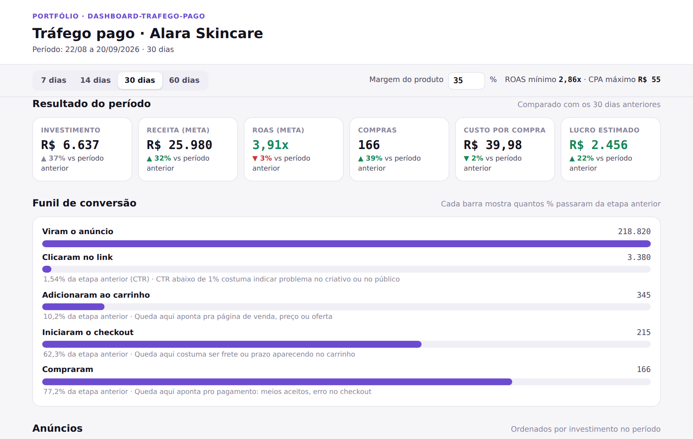
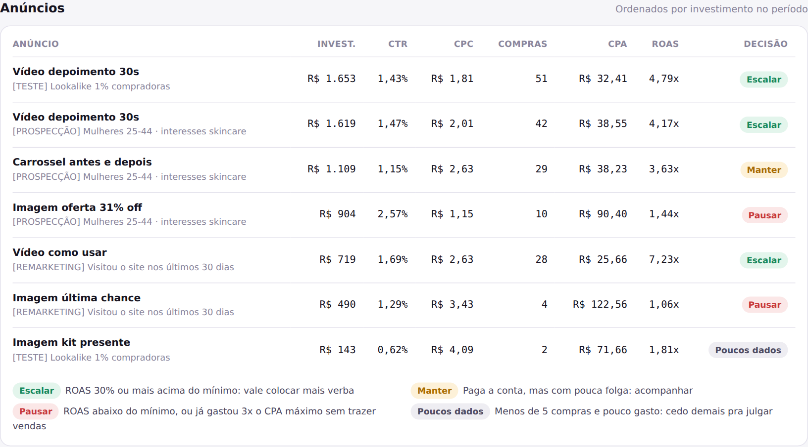
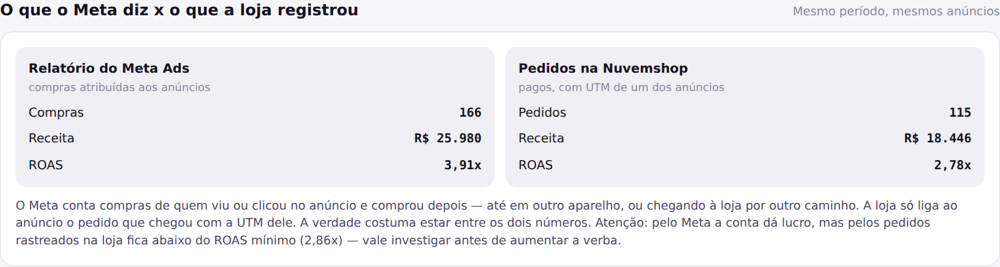

# Painel de Tráfego Pago (Meta Ads + Nuvemshop)

Projeto de portfólio: um painel que responde a pergunta que todo dono de
loja faz pro gestor de tráfego — **"qual anúncio está dando dinheiro?"** —
cruzando o relatório do Meta Ads com os pedidos reais da loja.

**Publicado em [dashboard-trafego-pago.vercel.app](https://dashboard-trafego-pago.vercel.app)**
— atualiza sozinho a cada push na `main`.

<p align="center">
  
</p>
<p align="center">
  
</p>

> **Em resumo (pra quem não é da área técnica):** quem investe em anúncio
> no Instagram recebe um relatório cheio de números (impressões, CTR,
> CPC...) que não diz o principal: se está sobrando dinheiro no fim. Este
> painel pega esse relatório e os pedidos da loja e mostra, em linguagem
> direta, quanto foi investido, quanto voltou, onde os clientes desistem
> da compra e o que fazer com cada anúncio — **escalar, manter ou pausar**
> — levando em conta a margem de lucro do produto.

## Por que esse projeto

As vagas de gestor de tráfego no Workana pedem, quase sempre, a mesma
entrega além das campanhas: **relatórios semanais claros**, acompanhando
os indicadores e sugerindo melhorias. Ferramentas prontas (Reportei,
por exemplo) fazem relatório bonito, mas repetem os números do Meta — não
dizem se o anúncio dá lucro pro produto *daquela* loja.

Este projeto continua o [projeto 4](https://github.com/jvtdemiranda/landing-produto-trafego-pago)
(página de venda da mesma marca fictícia, Alara): lá, a página grava de
qual anúncio o visitante veio (UTM) e passa isso pro checkout; aqui, o
painel usa essas UTMs dos pedidos pra conferir o que o Meta diz.

## Os conceitos por trás do painel

Cada número do painel responde uma pergunta de negócio:

- **ROAS** (retorno sobre o investimento em anúncio) = receita ÷
  investimento. ROAS 4x quer dizer que cada R$ 1 em anúncio trouxe R$ 4
  em vendas. Mas **vender R$ 4 não é lucrar R$ 3** — do valor da venda
  ainda sai o custo do produto, impostos, taxa do cartão e frete.
- **ROAS mínimo (ou "de equilíbrio")** = 1 ÷ margem. Com 35% de margem, o
  anúncio precisa de ROAS 2,86x só pra empatar. Por isso o painel pede a
  margem do produto: o mesmo ROAS 3x é lucro pra quem tem 40% de margem e
  prejuízo pra quem tem 25%. Mude a margem no topo e todas as decisões se
  recalculam.
- **CPA máximo** = ticket médio × margem: o máximo que dá pra pagar por
  uma venda sem prejuízo. Serve pra julgar anúncio com poucas vendas —
  se ele já gastou 3 vezes esse valor e quase não vendeu, não precisa
  esperar mais pra pausar.
- **Funil** — impressões → cliques → carrinho → checkout → compra. Cada
  etapa aponta um problema diferente: CTR baixo (abaixo de ~1%) é
  criativo ou público errado; muita gente clica e não põe no carrinho é
  a página ou a oferta; desistência entre carrinho e checkout costuma ser
  frete ou prazo.
- **CTR alto não é sinônimo de venda.** No exemplo, o anúncio "Imagem
  oferta 31% off" tem o maior CTR da conta (2,57%) e o pior ROAS (1,44x):
  o "31% off" atrai clique curioso de quem não compra. Olhando só CTR,
  ele pareceria o melhor anúncio.
- **Atribuição: o Meta e a loja não contam igual.** O Meta credita ao
  anúncio compras de quem viu (sem nem clicar) ou clicou e comprou dias
  depois, até em outro aparelho. A loja só liga ao anúncio o pedido que
  chegou com a UTM dele. Nos dados do exemplo, nos últimos 30 dias o Meta
  mostra **ROAS 3,91x** (lucro) e os pedidos rastreados na loja dão
  **2,78x** — abaixo do mínimo de 2,86x. O painel mostra os dois lado a
  lado e avisa quando um diz lucro e o outro diz prejuízo, porque é
  exatamente a situação em que um gestor desatento aumenta a verba de uma
  conta que está perdendo dinheiro.

<p align="center">
  
</p>

## A regra de decisão por anúncio

| Decisão | Quando |
|---|---|
| **Escalar** | ROAS pelo menos 30% acima do mínimo |
| **Manter** | ROAS acima do mínimo, com pouca folga |
| **Pausar** | ROAS abaixo do mínimo — ou menos de 5 vendas depois de gastar 3x o CPA máximo |
| **Poucos dados** | Menos de 5 vendas e pouco gasto: cedo demais pra julgar |

É uma regra simples de propósito, pra ser explicável pro cliente em uma
frase. Os limites (30%, 5 vendas, 3x) ficam em constantes no começo do
JavaScript do painel, fáceis de ajustar.

## Como funciona

```
dashboard-trafego-pago/
├── data/raw/
│   ├── meta_ads_export.csv      -> relatório diário por anúncio, no formato do Gerenciador de Anúncios
│   └── pedidos_nuvemshop.csv    -> pedidos da loja, com as UTMs de origem
├── scripts/
│   ├── gerar_dados.py           -> gera os dois arquivos simulados (período e semente fixos)
│   ├── gerar_dashboard_html.py  -> lê os CSVs, liga pedidos a anúncios pelas UTMs, gera a página
│   └── dashboard_template.html  -> o painel (HTML/CSS/JS)
├── public/index.html            -> o que a Vercel publica
└── docs/                        -> screenshots deste README
```

```bash
cd scripts
python gerar_dados.py            # só pra recriar os dados simulados
python gerar_dashboard_html.py   # gera public/index.html
```

Sem dependências externas: só a biblioteca padrão do Python.

**Pra usar com dados reais**, basta trocar os dois CSVs: no Gerenciador
de Anúncios, exportar o relatório com detalhamento por dia e por
anúncio (colunas de valor usado, impressões, cliques no link, adições ao
carrinho, finalizações de compra iniciadas, compras e valor de conversão);
na Nuvemshop, exportar os pedidos com os campos de UTM.

## Decisões de projeto

- **Os cálculos ficam no navegador, não no Python.** Assim o período (7,
  14, 30 ou 60 dias) e a margem mudam na hora, sem gerar a página de novo.
  O Python só faz a parte chata: ler CSV brasileiro (separador `;`,
  vírgula decimal) e ligar cada pedido ao anúncio pelas UTMs.
- **Comparação com o período anterior, não com "média do mercado".**
  Benchmark de mercado varia demais por nicho, época e público; o
  histórico da própria conta é a referência mais honesta. Cada indicador
  mostra a variação contra os dias imediatamente anteriores.
- **Alcance não aparece no painel**, embora venha no relatório do Meta:
  alcance é "pessoas únicas", e somar o alcance de cada dia conta a mesma
  pessoa várias vezes. Um total somado estaria errado.
- **Dados reproduzíveis.** O projeto 1 do portfólio gerava datas
  relativas a "hoje", o que impedia o CI de conferir os dados. Aqui o
  período é fixo e a semente aleatória também: o CI regenera tudo e falha
  se algo commitado não bater.

## Bugs reais encontrados no processo

1. **Funil com escala distorcida.** A primeira versão desenhava as barras
   do funil em escala de raiz quadrada, pra que as etapas pequenas não
   sumissem ao lado das 218 mil impressões. Funciona visualmente, mas
   distorce as proporções sem avisar quem lê. Troquei por uma escala
   honesta: cada barra mostra a porcentagem que passou da etapa anterior
   — que é, afinal, a pergunta que um funil responde.
2. **Anúncio ruim marcado como "Poucos dados".** A primeira regra de
   decisão só julgava anúncios com 5 vendas ou mais. Nos testes, um
   anúncio de remarketing tinha gastado R$ 490 pra vender 4 vezes (ROAS
   1,06x) e aparecia como "cedo demais pra julgar" — mas ele já tinha
   gastado quase 9 vezes o que a loja pode pagar por venda. Um gestor
   experiente pausaria sem hesitar. A regra passou a considerar o CPA
   máximo: gastou 3x esse valor sem vender, pausa.
3. **Valores do eixo do gráfico em cima da linha.** Os rótulos (R$ 390,
   R$ 779...) estavam dentro da área do gráfico e eram cortados pelas
   linhas; foram pra uma margem própria à esquerda.

Testes feitos: os números da tela conferidos contra um cálculo
independente direto nos CSVs; nomes de anúncio com HTML/script
malicioso (não executa — tudo que vem do CSV é escapado); sem rolagem
horizontal de 320px a 1280px; dados idênticos gerados em Python 3.11 e
3.12.

## Stack

Python 3 (só biblioteca padrão) e HTML/CSS/JavaScript puro, com gráfico
em SVG desenhado à mão. Deploy na Vercel; CI no GitHub Actions.

---

Alara Skincare é uma marca fictícia e os dados são simulados.
